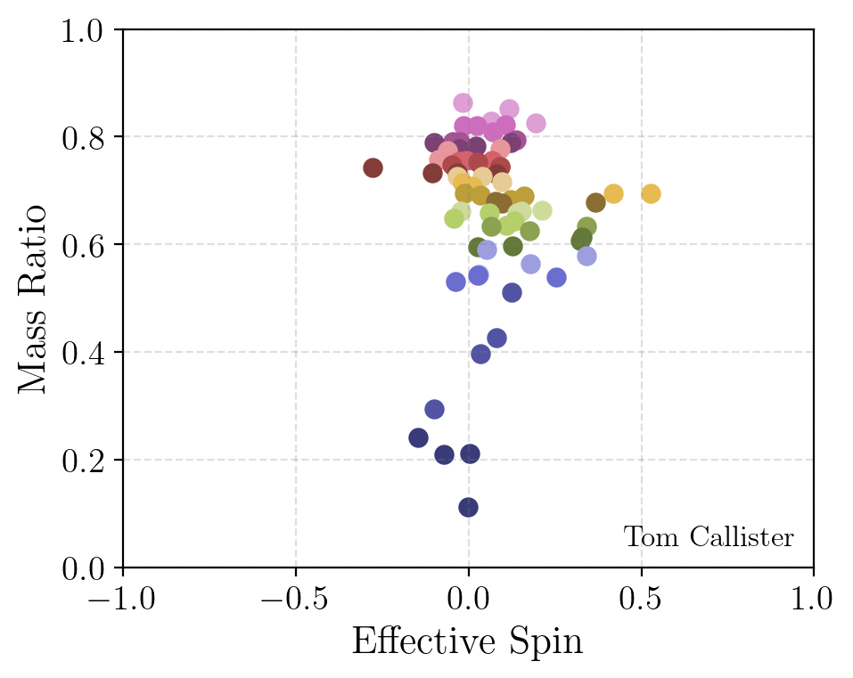
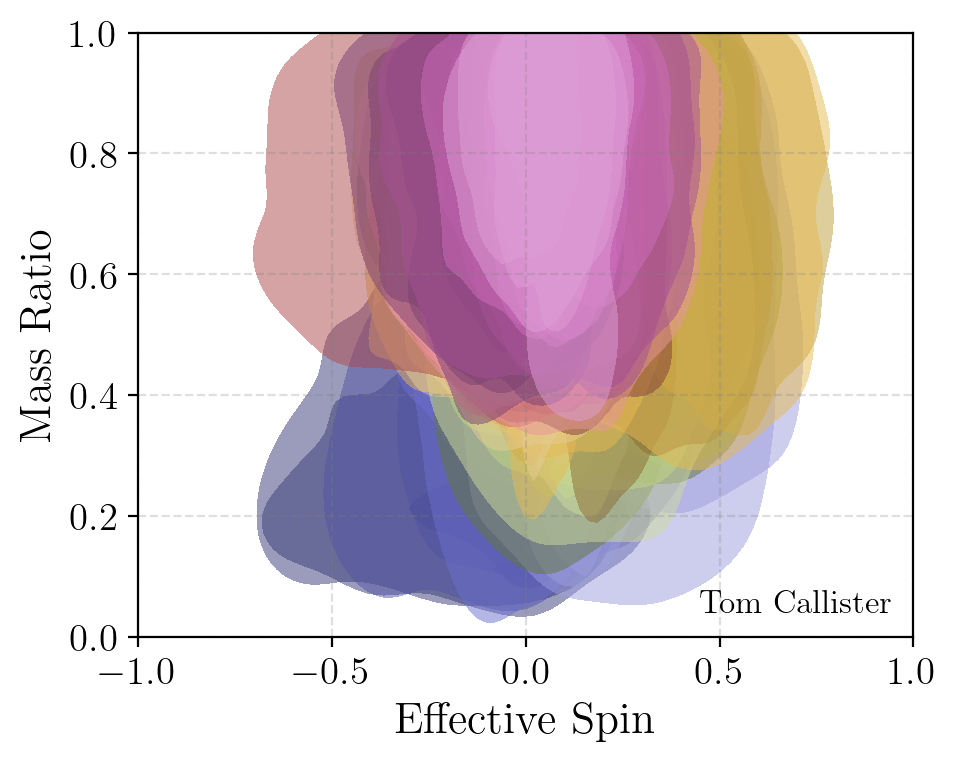

# q-vs-chi-effective-pollock-plot

Plots illustrating the mass ratio and effective spin measurements of CBC detections through the GWTC-3 catalog.
In contrast to mass and redshift, which *appear* to show a correlation but in fact have none (see https://github.com/gw-gallery/mass-vs-redshift-pollock-plot), mass ratio and effective spin do not by eye show any intrinsic correlation but are indeed anticorrelated.

### Plot 1: Scatter

Scatter plot of median posterior mass ratios and effective spins (under a default, uninformative prior):

### Plot 2: An "honest" scatter

The same plot, but now with "blobs" that show the central 90% credible posterior bounds on each event's mass ratio and spin.

